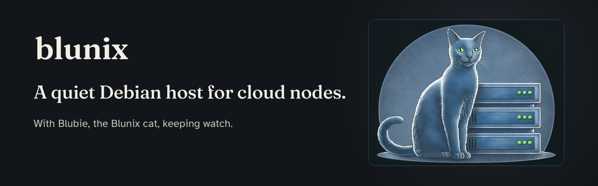

<p align="center"></p>

# blunix

A quiet Debian host for cloud nodes and bare metal. Small by default. Able to speak, if you ask it to, before it asks you anything.

Blunix is named for the Russian Blue: quiet, small, watchful. It is built so that a blind or low-vision operator can install and run a machine without seeing the screen. The boot menu has speech, braille and large-print entries. Every prompt is one sentence.

Website: [blunix.io](https://blunix.io). How the pieces fit: [docs/architecture.md](docs/architecture.md).

## What is real today

- **Built and released.** [v0.1.0](https://github.com/afterdarksys/blunix/releases/tag/v0.1.0): an unsigned test release on Debian 13. It contains:
  - the installer ISO, which boots UEFI and BIOS
  - the disk image
  - netboot media
  - `SHA256SUMS`
- **Built and tested, not deployed yet.**
  - The web portal at build.blunix.io. It makes your key in the browser and encrypts your build with [age](https://age-encryption.org).
  - The API at api.blunix.io.
  - Build hosts at `{label}.blnx.io`.
  - The `blunix proxy` for static-address and netboot LANs.
- **Designed, not built.** Image signing, A/B rollback, enrolled machines, and the troubleshoot collector. The design docs are in [docs/designs/](docs/designs/).

## Install, in two prompts

1. On the portal, reserve a hostname and compose the build. The browser makes a 20-character key, encrypts, and uploads only the ciphertext. You get an install card.
2. Boot the installer. It asks for the build hostname (`ada.blnx.io`), then the key, with echo off. It fetches the encrypted document over TLS, decrypts it on the machine, checks the disk image's sha256, writes the disk, and applies the document.

The key never reaches a server. A wrong key applies nothing.

## Verify a download

Download the files and `SHA256SUMS` into one folder, then:

```
sha256sum -c --ignore-missing SHA256SUMS      # Linux
shasum -a 256 -c SHA256SUMS                   # macOS
```

Every line must say OK. Nothing is signed yet; the checksum proves the bytes match the build, not who built it.

## Layout

| Path | What |
|---|---|
| `lib/blunix/` | The host tools, installer, bootstrap and build-proxy (Python, Debian's `age`). |
| `image/` | Image, release and installer builds, release secret scans, iPXE. |
| `platform/api/` | The Cloudflare Worker API (TypeScript, D1, R2). |
| `portal/`, `site/` | build.blunix.io and blunix.io (static, Cloudflare Pages). |
| `brand/` | The logo, Blubie the mascot, diagrams, and the brand guide. |
| `docs/` | The architecture walk-through and the design documents. |

## Build and install source packages

`gitbuild` prepares repositories from `straticus1` and `afterdarksys` using
Python, Go, Rust, Bash, Node, PHP, or explicit mixed-language recipes. Products
install under `/usr/local/afterdarksys/<product>` with managed relative links in
`/usr/local`. Builds run as an ordinary user; installation is a separate step.

```
./apply/gitbuild doctor --system go
./apply/gitbuild prepare afterdarksys/example --ref <commit> --output build/example
sudo ./apply/gitbuild install build/example
./apply/gitbuild verify example
```

Replace `example` and `<commit>` with the intended repository and revision.
See [the gitbuild guide](docs/gitbuild.md) for recipes, upgrades, configuration
preservation, removal, and limitations. The [tooling assessment](docs/tooling-assessment.md)
tracks the remaining troubleshooting, packaging, and automation work.

## Tests

```
bash image/run-unit-tests.sh                  # Python suite, in Debian 13 with age
(cd platform/api && npm ci && npm test)       # API
node --test tests/site/releases.test.mjs tests/site/portal.test.mjs
```

## License

- **Blunix's own code:** source-available under the [PolyForm Noncommercial License 1.0.0](LICENSE). It is free for personal use and for noncommercial organizations such as schools, schools for the blind, charities and public institutions. Commercial use needs a commercial license: see [COMMERCIAL.md](COMMERCIAL.md) or email licensing@blunix.io.
- **Debian packages inside the images:** they keep their own licenses, many of them the GNU GPL. Each release's `SOURCES.md` links the exact source of every package and carries a written offer.
- **Bundled third-party code and fonts:** see [THIRD_PARTY_NOTICES.md](THIRD_PARTY_NOTICES.md).
- **The logo and Blubie artwork:** © After Dark Systems, LLC.
- **Contributing:** see [CONTRIBUTING.md](CONTRIBUTING.md). Contributors sign the [CLA](CLA.md) once, by commenting on their first pull request.

---

Built by people who keep cats. blunix.com is Blunix GmbH in Berlin, a different company.
