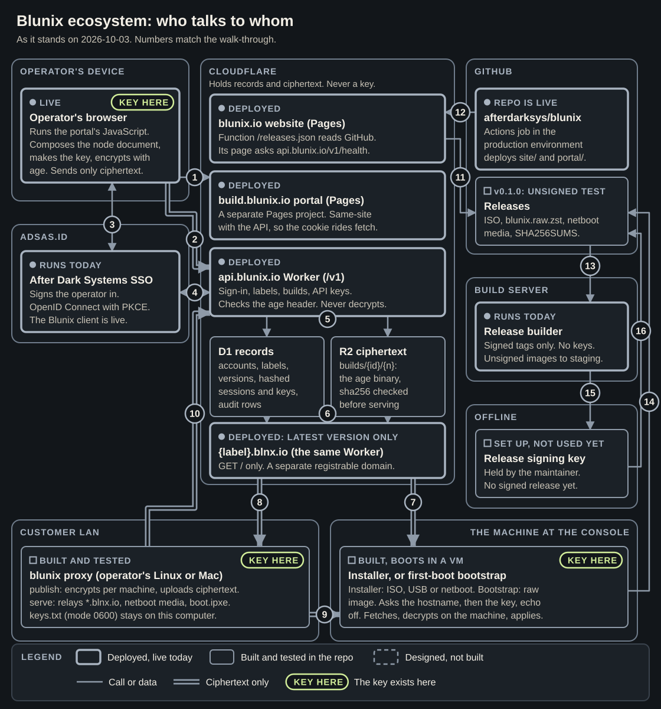
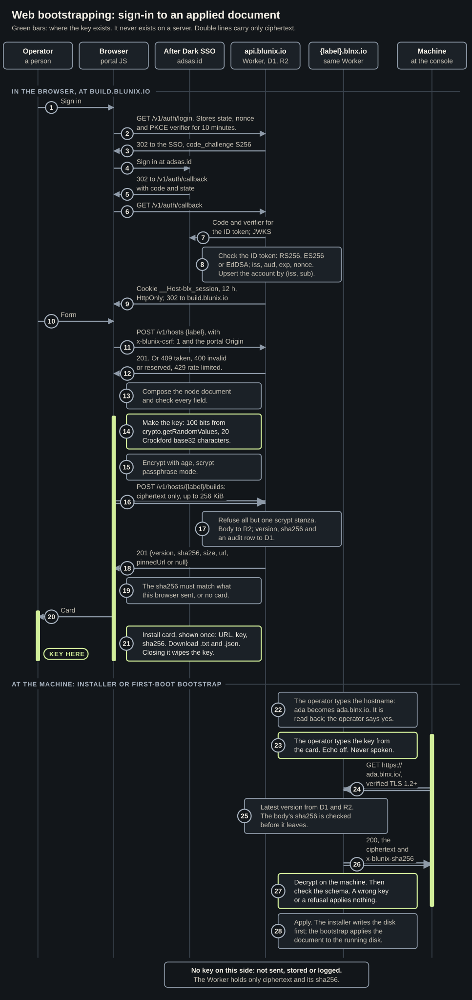
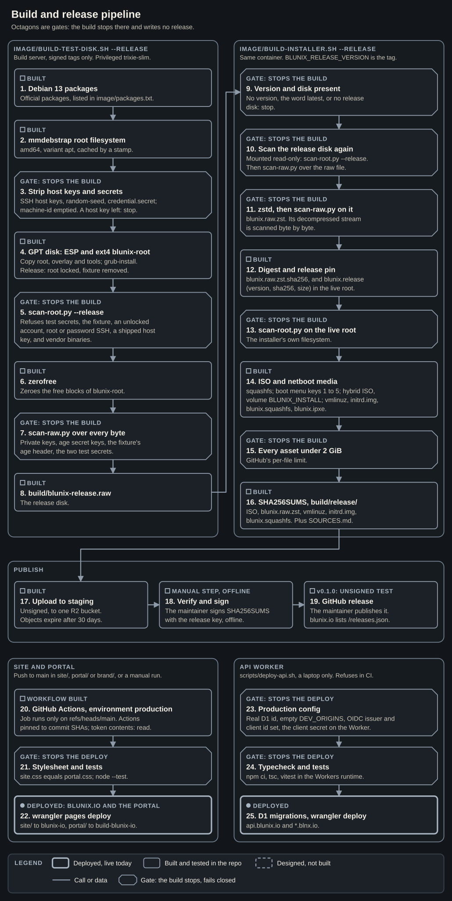
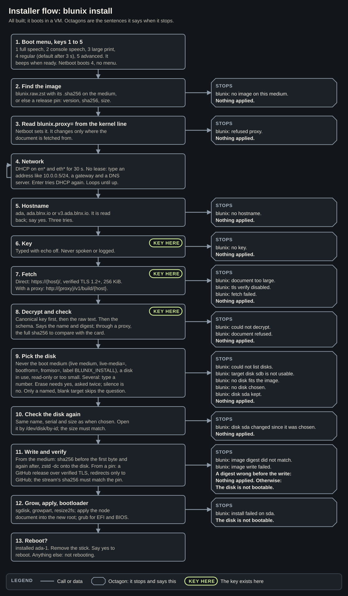
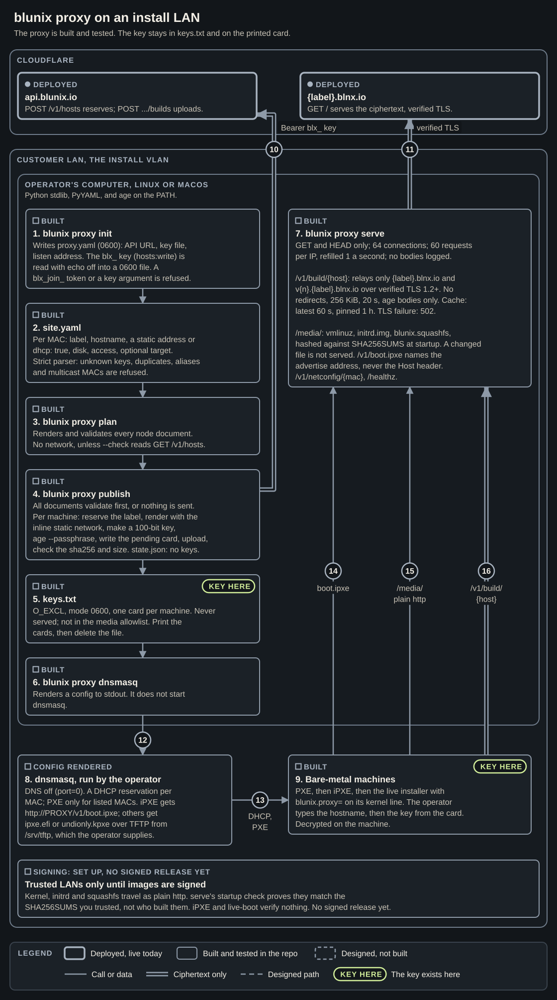
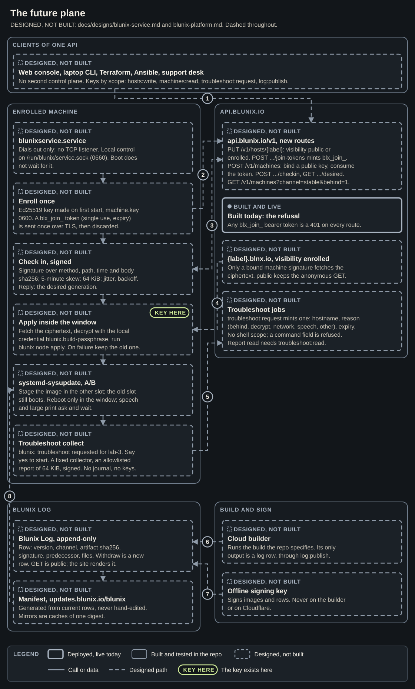

> Current personal-build flow: new portal builds capture the target disk, erase
> approval, packages, administrator, and reboot choices before encryption. The
> installer uses DHCP and asks only for build address and build password. The
> diagrams below describe the earlier/legacy confirmation flow; see
> [Personal builds](personal-builds.md) for the current contract and community API.

# Architecture

How the Blunix install plane fits together, drawn from the code as it stands on 2026-09-30. The same drawings and walk-throughs are on `site/architecture.html`. The walk-through under each drawing says everything the drawing says.

Sources: `brand/src/tools/diagrams.py` draws them (`python3 brand/src/tools/diagrams.py`), and `brand/src/tools/diagrams-png.sh` renders the PNGs at 2x.

## Reading the drawings

- **Deployed, live today:** a heavy solid border and a filled dot.
- **Built and tested in the repo:** a thin solid border and a hollow square.
- **Designed, not built:** a dashed border and a dashed square. A dashed line is a designed path.
- **A double line carries only ciphertext.** A single line is any other call or data.
- **An octagon is a gate or a stop:** the build, deploy or install stops there and says why.
- **KEY HERE** marks where the key exists. It never exists on a server.

## 1. Who talks to whom

PNG at 2x: [`brand/diagrams/01-ecosystem.png`](../brand/diagrams/01-ecosystem.png)

#### What each zone holds

- **Operator's device.** The operator's browser runs the portal's JavaScript (built). It composes the node document, makes the key, and encrypts with age. The key exists here. The browser sends only ciphertext.
- **adsas.id.** Authentik, the OIDC issuer, runs today. The Blunix client is not set up yet: `OIDC_ISSUER` is empty in `platform/api/wrangler.jsonc`, so sign-in answers 503 until it is.
- **Cloudflare** holds records and ciphertext, never a key. The blunix.io website on Pages is deployed. Its function `/releases.json` reads GitHub, and its page asks `api.blunix.io/v1/health` whether the API is up.
- **Cloudflare, continued.** The build.blunix.io portal is a separate Pages project, built and not deployed; today that name answers a placeholder. It is same-site with the API, so the session cookie rides the portal's `fetch` calls.
- **Cloudflare, continued.** The api.blunix.io Worker (`/v1`) is built and not deployed; today that name answers a placeholder. It handles sign-in, labels, builds and API keys. It checks the age header and never decrypts. D1 holds accounts, labels, versions, hashed sessions and hashed API keys, audit rows and rate limits. R2 holds each build at `builds/{label id}/{version}` as the binary age file, and its sha256 is checked before it is served.
- **Cloudflare, continued.** `{label}.blnx.io` is the same Worker: `GET` and `HEAD` on `/` only. blnx.io is a separate registrable domain, so build hosts never share cookies with the site, the portal or the API. Built, not deployed: blnx.io has no DNS yet.
- **GitHub.** The repo `afterdarksys/blunix` is live. Its Actions job, in the `production` environment, deploys `site/` and `portal/`. Releases will hold the ISO, `blunix.raw.zst`, the netboot media and `SHA256SUMS`; none is published yet.
- **Our servers.** The image builder. The build scripts are built and run in privileged Docker. No builder host is set up in the tree yet.
- **Offline.** The image signing key: designed, not built. It is never on the builder and never on Cloudflare. Nothing is signed today.
- **Customer LAN.** `blunix proxy` on the operator's Linux or Mac, built. `publish` encrypts per machine and uploads ciphertext. `serve` relays `*.blnx.io` and serves netboot media and `boot.ipxe`. The keys are in `keys.txt`, mode 0600, on this computer. The key exists here.
- **The machine at the console.** The installer (ISO, USB or netboot) or the first-boot bootstrap (raw image), built and booting in a VM. It asks the hostname, then the key with echo off, fetches, decrypts on the machine, and applies. The key exists here while it is typed.

#### The numbered connections

1. The browser loads the portal page from build.blunix.io.
2. The browser calls api.blunix.io with the session cookie (`credentials: 'include'`). The build upload on this path is ciphertext only.
3. The browser and Authentik: the OIDC sign-in redirects, both ways.
4. The Worker and Authentik: the Worker trades the code and the PKCE verifier for an ID token, and fetches the JWKS to check it.
5. The Worker reads and writes D1 and R2.
6. The build hosts read D1 and R2.
7. `{label}.blnx.io` to the machine: HTTPS `GET /` over verified TLS. Ciphertext only.
8. `{label}.blnx.io` to the proxy: the proxy fetches over verified TLS. Ciphertext only.
9. The proxy to the machine: plain http on the LAN. Ciphertext only. It is safe because age is authenticated; through a proxy the installer also says the full sha256 to compare with the install card.
10. The proxy to the Worker: `publish` reserves labels and uploads ciphertext with a `blx_` API key.
11. The site's `/releases.json` function reads the GitHub Releases API and each release's `SHA256SUMS`.
12. GitHub Actions deploys the site and the portal to Cloudflare Pages.
13. The builder's assets reach Releases only when a person runs `gh release upload`. The build does not upload.
14. The installer streams the image from a GitHub release when its medium carries only a release pin. The stream's sha256 must match the pin.
15. Designed, not built: the offline key signs the builder's digests.

## 2. From sign-in to an applied document

PNG at 2x: [`brand/diagrams/02-web-bootstrap.png`](../brand/diagrams/02-web-bootstrap.png)

Six participants: the operator, the browser running the portal, Authentik at adsas.id, the api.blunix.io Worker (with D1 and R2), the `{label}.blnx.io` build host (the same Worker), and the machine at the console. The key exists in three places only: the browser, from step 14 until the install card closes in step 21; the operator's install card, from step 20; and the machine, from step 23 until it decrypts in step 27. It is never on a server.

#### In the browser, at build.blunix.io

1. The operator asks the browser to sign in.
2. The browser calls `GET /v1/auth/login`. The Worker stores the state, the nonce and the PKCE verifier for 10 minutes.
3. The Worker answers 302 to Authentik, with `code_challenge` and method `S256`.
4. The operator signs in at adsas.id.
5. Authentik answers 302 to `/v1/auth/callback` with the code and the state.
6. The browser calls `GET /v1/auth/callback`.
7. The Worker sends Authentik the code and the verifier for the ID token, and fetches the JWKS.
8. The Worker checks the ID token: algorithm RS256, ES256 or EdDSA only; `iss`, `aud`, `exp` and `nonce`. It upserts the account by `(iss, sub)`.
9. The Worker sets the cookie `__Host-blx_session` (12 hours, `HttpOnly`) and answers 302 to build.blunix.io.
10. The operator fills in the form: a label and the node document fields.
11. The browser calls `POST /v1/hosts {label}` with `x-blunix-csrf: 1` and the portal's `Origin`.
12. The Worker answers 201. Or 409 if the label is taken, 400 if it is invalid or reserved, 429 if rate limited.
13. The browser composes the node document and checks every field.
14. The browser makes the key: 100 bits from `crypto.getRandomValues`, 20 Crockford base32 characters. The key now exists in the browser.
15. The browser encrypts the document with age, scrypt passphrase mode.
16. The browser calls `POST /v1/hosts/{label}/builds` with ciphertext only, up to 256 KiB.
17. The Worker refuses anything but an age file with one scrypt stanza. It stores the body in R2, and the version, the sha256 and an audit row in D1.
18. The Worker answers 201 with the version, sha256, size, URL, and a pinned URL, or null while pinned hosts have no certificates.
19. The browser checks that the sha256 matches what it sent. If not, no card is shown.
20. The browser hands the operator the install card. The key now exists on the card.
21. The card is shown once: the URL, the key and the sha256, with .txt and .json downloads. Closing it wipes the key from the page.

#### At the machine: the installer or the first-boot bootstrap

22. The operator types the hostname. `ada` becomes `ada.blnx.io`. It is read back, and the operator says yes.
23. The operator types the key from the card. Echo is off and it is never spoken. The key now exists on the machine.
24. The machine calls `GET https://ada.blnx.io/` over verified TLS 1.2 or higher, capped at 256 KiB.
25. The build host takes the latest version from D1 and R2, and checks the body's sha256 before it leaves.
26. The build host answers 200 with the ciphertext and `x-blunix-sha256`.
27. The machine decrypts on the machine, then checks the schema. A wrong key or a refusal applies nothing. The key is dropped after decryption.
28. The machine applies. The installer writes the disk first; the bootstrap applies the document to the disk it is running on.

The note at the bottom of the diagram says it plainly: no key on the server side. It is not sent, stored or logged. The Worker holds only ciphertext and its sha256.

## 3. Build and release

PNG at 2x: [`brand/diagrams/03-build-release.png`](../brand/diagrams/03-build-release.png)

Octagons are gates: the build stops there and writes no release. The first two columns run in privileged Docker (`debian:trixie-slim`).

#### image/build-test-disk.sh --release

1. Debian 13 packages: official packages, listed in `image/packages.txt`.
2. mmdebstrap builds the root filesystem: amd64, variant apt, cached by a stamp.
3. Gate: strip SSH host keys, the random seed and `credential.secret`, and empty the machine-id. A host key left behind stops the build.
4. A GPT disk with an ESP and an ext4 `blunix-root`. The root, the overlay and the tools are copied in, and grub is installed. For a release, root is locked and the test fixture is removed.
5. Gate: `scan-root.py --release` refuses test secrets, the fixture, an unlocked account, root or password SSH, a shipped host key, and vendor binaries.
6. zerofree zeroes the free blocks of `blunix-root`.
7. Gate: `scan-raw.py` reads every byte of the disk for private keys, age secret keys, the fixture's age header and the two test secrets.
8. The output is `build/blunix-release.raw`, the release disk. It feeds step 9.

#### image/build-installer.sh --release (needs BLUNIX_RELEASE_VERSION)

9. Gate: no version, the word `latest`, or no release disk stops the build.
10. Gate: the release disk is scanned again. It is mounted read-only for `scan-root.py --release`, then `scan-raw.py` reads the raw file.
11. Gate: zstd compresses it to `blunix.raw.zst`, and `scan-raw.py` scans the decompressed stream byte by byte.
12. The digest `blunix.raw.zst.sha256` and the release pin `blunix.release` (version, sha256, size) go into the live root.
13. Gate: `scan-root.py` scans the installer's own filesystem.
14. The ISO and netboot media: a squashfs, the boot menu with keys 1 to 5, a hybrid ISO with volume label `BLUNIX_INSTALL`, and `vmlinuz`, `initrd.img`, `blunix.squashfs` and `blunix.ipxe`.
15. Gate: every asset must be under 2 GiB, GitHub's per-file limit.
16. `SHA256SUMS` in `build/release/` covers the ISO, `blunix.raw.zst`, `vmlinuz`, `initrd.img` and `blunix.squashfs`. The build does not upload.

#### Publish

17. Designed, not built: sign the digests offline. The key is never on the builder or Cloudflare. Nothing is signed today. The dashed path runs through this step; the solid path skips it.
18. A manual step: a person runs `gh release upload` from `build/release/`.
19. The GitHub release on `afterdarksys/blunix`. blunix.io lists it through `/releases.json`. None is published yet.

#### Site and portal: push to main in site/, portal/ or brand/, or a manual run

20. GitHub Actions, environment `production` (the workflow is built). The job runs only on `refs/heads/main`. Actions are pinned to commit SHAs, and the token is `contents: read`.
21. Gate: `site/css/site.css` must equal `portal/css/site.css`, and the node tests must pass.
22. `wrangler pages deploy`: `site/` to the Pages project `blunix-io`, `portal/` to `build-blunix-io`. blunix.io is live; the portal is not. `scripts/deploy-site.sh` is the same path from a laptop.

#### API Worker: scripts/deploy-api.sh, a laptop only, refuses in CI

23. Gate: a production config. A real D1 id, an empty `DEV_ORIGINS`, the OIDC issuer and client id set, and the client secret on the Worker.
24. Gate: `npm ci`, the typecheck, and the vitest suite in the Workers runtime.
25. D1 migrations, then `wrangler deploy` for api.blunix.io and `*.blnx.io`. The script is built and has not run yet.

## 4. The installer

PNG at 2x: [`brand/diagrams/04-installer.png`](../brand/diagrams/04-installer.png)

All of this is built and boots in a VM. Each exit is the exact sentence the installer says. Every exit before the disk is written ends with Nothing applied. The key exists from step 6 to step 8.

1. Boot menu, keys 1 to 5: 1 full speech, 2 console speech, 3 large print, 4 regular (the default after 3 seconds), 5 advanced. The menu beeps when it is ready. Netboot boots regular, with no menu.
2. Find the image: `blunix.raw.zst` with its `.sha256` on the medium, or else a release pin (version, sha256, size). Exit: `blunix: no image on this medium. Nothing applied.`
3. Read `blunix.proxy=` from the kernel command line. Netboot sets it. It changes only where the document is fetched from. Exit: `blunix: refused proxy. Nothing applied.`
4. Network: DHCP on `en*` and `eth*` for 30 seconds. With no lease, type an address like `10.0.0.5/24`, then a gateway and a DNS server. Enter tries DHCP again. It loops until the network is up; there is no exit here.
5. Hostname: `ada`, `ada.blnx.io` or `v3.ada.blnx.io`. It is read back; say yes. Three tries. Exit: `blunix: no hostname. Nothing applied.`
6. Key: typed with echo off, never spoken or logged. The key now exists here. Exit, for an empty key: `blunix: no key. Nothing applied.`
7. Fetch: directly from `https://{host}/` over verified TLS 1.2 or higher, capped at 256 KiB, or with a proxy from `http://{proxy}/v1/build/{host}`. Exits: `blunix: document too large.`, `blunix: tls verify disabled.`, `blunix: fetch failed.`, each followed by Nothing applied.
8. Decrypt and check: the canonical key first, then the raw text as typed, then the schema. It says the document name and digest; through a proxy it says the full sha256 to compare with the install card. The key is dropped after this step. Exits: `blunix: could not decrypt.` or `blunix: document refused.`, then Nothing applied.
9. Pick the disk. Never the boot medium (the live medium, any disk named by `live-media=`, `bootfrom=` or `fromiso=`, or a disk labelled `BLUNIX_INSTALL`), a disk in use, a read-only disk, or one too small. With several, type a number. Erasing needs yes, asked twice; silence is no. Only a target named in the document that is blank skips the question. Exits: `could not list disks`, `target disk sdb is not usable`, `no disk fits the image`, `no disk chosen`, `disk sda kept`, each as a `blunix:` sentence followed by Nothing applied.
10. Check the disk again: the same name, serial and size as when it was chosen. It is opened by `/dev/disk/by-id`, and the opened size must match. Exit: `blunix: disk sda changed since it was chosen. Nothing applied.`
11. Write and verify. From the medium: the sha256 is checked before the first byte and again after, and `zstd -dc` writes the disk. From a release pin: the image streams from a GitHub release over verified TLS, redirects stay on GitHub, and the stream's sha256 must match the pin. Exits: `blunix: image digest did not match.` A digest found wrong before the write says Nothing applied; after the write, and for `blunix: image write failed.`, it says The disk is not bootable.
12. Grow, apply, bootloader: `sgdisk`, `growpart` and `resize2fs`; apply the node document into the new root; grub for EFI and BIOS. Exit: `blunix: install failed on sda. The disk is not bootable.`
13. Reboot: `blunix: installed ada-1. Remove the stick. Say yes to reboot.` Anything else: `blunix: not rebooting.`

Not drawn, but in the code: any answer typed at a second console stops with `blunix: another console is installing.`, and any unexpected error stops with `blunix: install failed.`

## 5. The build-proxy on a LAN

PNG at 2x: [`brand/diagrams/05-build-proxy.png`](../brand/diagrams/05-build-proxy.png)

Everything here is built and tested; the signing that would end the trusted-LAN rule is designed, not built. The key stays in `keys.txt` and on the printed card.

#### Cloudflare

- api.blunix.io, built and not deployed: `POST /v1/hosts` reserves a label; `POST /v1/hosts/{label}/builds` uploads.
- `{label}.blnx.io`, built and not deployed: `GET /` serves the ciphertext over verified TLS.

#### The operator's computer, Linux or macOS (Python stdlib, PyYAML, and age on the PATH)

1. `blunix proxy init` writes `proxy.yaml` (mode 0600): the API URL, the key file and the listen address. The `blx_` API key (scope `hosts:write`) is read with echo off into a 0600 file. A `blx_join_` token, or a key given as an argument, is refused.
2. `site.yaml` lists, per MAC: the label, the hostname, a static address or `dhcp: true`, the disk, the access profile, and an optional target disk. The parser refuses unknown keys, duplicate keys, aliases and multicast MACs.
3. `blunix proxy plan` renders and validates every node document. It makes no network call unless `--check` reads `GET /v1/hosts`.
4. `blunix proxy publish` validates every document first, or sends nothing. Then, per machine: reserve the label, render the document with its inline static network, make a 100-bit key, encrypt with `age --passphrase`, write the pending card, upload, and check the returned sha256 and size. `state.json` holds no keys.
5. `keys.txt`: created with `O_EXCL`, mode 0600, one card per machine. It is never served and is not in the media allowlist. The key exists here. Print the cards, then delete the file.
6. `blunix proxy dnsmasq` renders a dnsmasq config to stdout. It does not start dnsmasq.
7. `blunix proxy serve`: `GET` and `HEAD` only, at most 64 connections, 60 requests per IP refilled at one a second, and no bodies logged. `/v1/build/{host}` relays only `{label}.blnx.io` and `v{n}.{label}.blnx.io` over verified TLS 1.2 or higher, with no redirects, a 256 KiB cap, a 20-second limit and age bodies only, cached 60 seconds for latest and 1 hour for pinned; a TLS failure is a 502. `/media/` serves `vmlinuz`, `initrd.img` and `blunix.squashfs`, hashed against `SHA256SUMS` at startup; a file that changes later is not served. `/v1/boot.ipxe` names the advertise address, never the Host header. Also `/v1/netconfig/{mac}` and `/healthz`.

#### On the install VLAN

8. dnsmasq, run by the operator with the rendered config: DNS off (`port=0`), a DHCP reservation per MAC, and PXE only for listed MACs. iPXE clients get `http://PROXY/v1/boot.ipxe`; others get `ipxe.efi` or `undionly.kpxe` over TFTP from `/srv/tftp`, which the operator supplies.
9. Bare-metal machines: PXE, then iPXE, then the live installer with `blunix.proxy=` on its kernel line. The operator types the hostname, then the key from the card. The key exists here. The document is decrypted on the machine.

#### The numbered arrows

10. `publish` to api.blunix.io: reserve and upload, ciphertext only, with the `Bearer blx_` key.
11. `serve` to `{label}.blnx.io`: verified TLS, ciphertext only.
12. The rendered config goes to dnsmasq, which the operator starts.
13. dnsmasq to the machines: DHCP and the PXE boot file.
14. The machines fetch `boot.ipxe` from `serve`.
15. The machines fetch the kernel, initrd and squashfs from `/media/` over plain http.
16. The installer fetches `/v1/build/{host}` from `serve`: ciphertext only.

Trusted LANs only until images are signed. The kernel, initrd and squashfs travel as plain http. `serve`'s startup check proves they match the `SHA256SUMS` you trusted, not who built them. iPXE and live-boot verify nothing. Signing is designed, not built.

## 6. Later: the future plane (designed, not built)

PNG at 2x: [`brand/diagrams/06-future-plane.png`](../brand/diagrams/06-future-plane.png)

Everything on this diagram is designed, not built, from `docs/designs/blunix-service.md` and `docs/designs/blunix-platform.md`. One box is the exception: the API already refuses every `blx_join_` bearer token with 401 on every route. That refusal is built, not deployed.

#### The boxes

- **Clients of one API.** The web console, the laptop CLI, Terraform, Ansible and the support desk. There is no second control plane. Keys by scope: `hosts:write`, `machines:read`, `troubleshoot:request`, `log:publish`.
- **api.blunix.io, new routes.** `PUT /v1/hosts/{label}` sets visibility to public or enrolled. `POST /v1/hosts/{label}/join-tokens` mints a `blx_join_` token. `POST /v1/machines` binds a public key and consumes the token. `POST /v1/machines/{hostname}/checkin` and `GET .../desired`. `GET /v1/machines?channel=stable&behind=1` lists machines behind the channel head.
- **`{label}.blnx.io` with visibility enrolled.** Only a bound machine's signature fetches the ciphertext. Public keeps the anonymous `GET`.
- **Troubleshoot jobs.** `troubleshoot:request` mints one: a hostname, a reason (behind, decrypt, network, speech, other) and an expiry. There is no shell scope, and a command field is refused. Reading the report needs `troubleshoot:read`.
- **Enrolled machine, blunixservice.service.** It dials out only and has no TCP listener. Local control is on `/run/blunix/service.sock` (0660). Boot does not wait for it.
- **Enroll once.** An Ed25519 key is made on first start, in `machine.key`, mode 0600. A `blx_join_` token (single use, with an expiry) is sent once over TLS, then discarded.
- **Check in, signed.** The signature covers the method, the path, the time and the body's sha256, with a 5-minute skew, a 64 KiB cap, jitter and backoff. The reply is the desired generation.
- **Apply inside the window.** Fetch the ciphertext, decrypt with the local credential `blunix.build-passphrase`, run `blunix node apply`. On failure, keep the old document. The key exists here, as that credential.
- **systemd-sysupdate, A/B.** Stage the image in the other slot; the old slot still boots. Reboot only in the window. Speech and large-print machines ask and wait.
- **Troubleshoot collect.** `blunix: troubleshoot requested for lab-3. Say yes to start.` A fixed collector, an allowlisted report of 64 KiB, signed. No journal text and no keys.
- **Blunix Log, append-only.** A row holds the version, channel, artifact sha256, signature, predecessor and file names. Withdrawing is a new row. `GET` is public; the site renders it.
- **Manifest at `updates.blunix.io/blunix`.** Generated from the current rows, never edited by hand. Mirrors are caches of one digest.
- **Cloud builder.** Runs the build the repo specifies. Its only output is a log row, through `log:publish`.
- **Offline signing key.** Signs images and rows. Never on the builder or on Cloudflare.

#### The numbered arrows, all designed

1. The clients call api.blunix.io.
2. The machine enrolls with its join token.
3. Check-in and the desired generation, both ways.
4. The build host sends the ciphertext to the apply step.
5. The collect sends its signed report to the troubleshoot job.
6. The cloud builder appends a log row.
7. The offline key signs the rows.
8. systemd-sysupdate reads the manifest.

## Where the code and the contract disagree

The contract is `docs/designs/blunix-install-plane.md`. The drawings follow the code.

1. **Network fallback.** The contract says that with no DHCP lease the installer uses the proxy from `blunix.proxy=`. In the code, `blunix.proxy=` is read before the network and changes only where the document is fetched from. The network is DHCP for 30 s, then a typed static address, in a loop. The proxy never gives the installer an address; on a netboot LAN, dnsmasq's DHCP reservation does. The contract and `site/install.html` were corrected on 2026-09-30 to match the code.
2. **`/v1/netconfig/{mac}` has no caller.** `blunix proxy serve` answers it, as the contract says, but neither the installer nor the bootstrap requests it.
3. **The erase question.** The contract asks for a yes when a disk already has partitions. The code asks whenever the document names no `target`, even for a blank disk, and skips the question only for a named target that is blank. The code is stricter.
4. **keys.txt order.** The contract lists writing `keys.txt` last. The code appends a pending card and fsyncs it before the upload, then appends `Published:` or `Not confirmed:`. That is deliberate, so a lost API answer never loses a key.
5. **Proxy command names.** The contract writes `blunix proxy site.yaml`. The code has `blunix proxy plan` and `blunix proxy publish` (the contract names these too, a line later).
6. **The legacy host form.** The contract keeps `name-1042.build.blunix.io` so the fixture boots, and the installer accepts it. The proxy relay refuses it, so a legacy host installs directly but not through a proxy.
7. **Pinned URLs.** The contract's hand-off always shows `https://v3.ada.blnx.io/`. The Worker returns `pinnedUrl: null` until `PINNED_HOSTS_TLS` is `on`, and the portal and the card then leave it out. The contract's deploy notes explain why; its hand-off section does not.
8. **Routes not in the contract.** The Worker answers `GET /v1/health` (public, CORS for blunix.io only), which the site's `js/live.js` calls. An upload with the wrong content type is `415 unsupported media type`, not the contract's `400 refused ciphertext`. Reserving past 20 labels is `403 label limit`.
9. **Image source.** The contract says the medium's image, "or updates.blunix.io later". The code falls back to a GitHub release named by a pin on the medium, over verified TLS, checked against the pinned sha256.
10. **The builder.** The contract places the builder on our servers, on a clean host, using mkosi or Docker. The code runs the scripts in privileged Docker from a Mac or a Linux host; no builder host is set up in the tree, and `image/mkosi/` is not used by these scripts. The build never uploads: a person runs `gh release upload`.
11. **Two apiVersion domains.** Node documents are `apiVersion: blunix.dev/v1`; the offline `InstallBundle` is `apiVersion: blunix.io/v1`. Both match the contract, but the two domains differ.
12. **The first-boot bootstrap.** The raw image's bootstrap has no proxy and no typed static address. It waits for a DHCP address (18 checks, 5 s apart), then fails closed. Only the live installer has the fallbacks.
13. **Deployment, as of 2026-09-30.** blunix.io and `/releases.json` are live (no releases yet). build.blunix.io and api.blunix.io answer placeholders, blnx.io has no DNS, `wrangler.jsonc` still has the all-zero D1 id, and `OIDC_ISSUER` is empty. The contract's status line says BUILDING, which matches.
